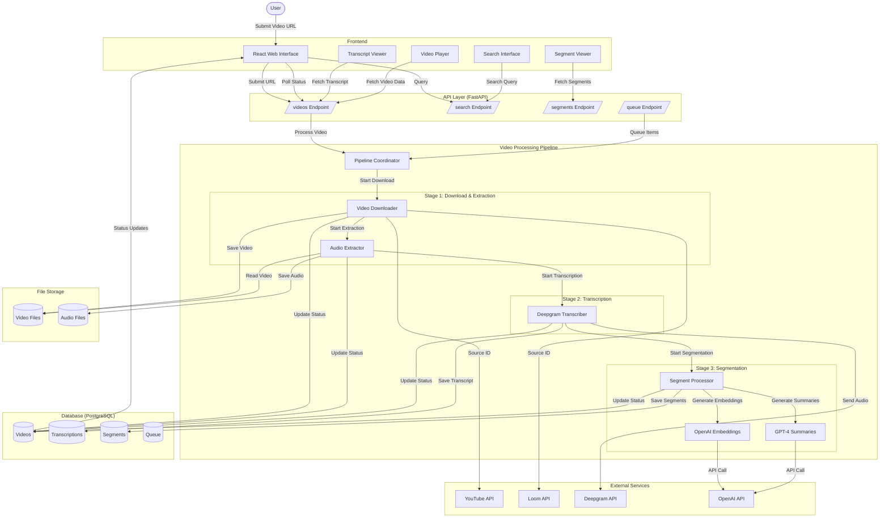

# Video Analytics System

A comprehensive pipeline for processing, analyzing, and exploring video content with AI-powered features including transcription, segmentation, summarization, and semantic search.


*The dashboard shows a grid view of processed videos with thumbnails, titles, and interactive elements for accessing video content and AI-generated insights.*

## System Overview

The video analytics system processes video content through a modular pipeline, extracting audio, generating transcripts, segmenting content, and providing AI-powered insights. The system enables users to search, analyze, and interact with video content in powerful ways.

## Features

- **Video Processing Pipeline**: Automated processing of YouTube and Loom videos
- **Speaker Diarization**: Automatic speaker identification in transcripts
- **Semantic Search**: Find relevant video segments using natural language queries
- **Segment Navigation**: Jump directly to relevant parts of videos
- **Interactive Transcript**: Explore video content through searchable transcripts
- **Progress Tracking**: Real-time status updates on video processing
- **Bulk Processing**: Queue system for handling multiple videos

## Architecture

The system follows a modular, pipeline-based architecture that processes videos through several sequential stages:



### Core Components

1. **Frontend (React)**
   - User interface for submitting video URLs
   - Video playback and navigation
   - Transcript and segment exploration
   - Search functionality
   - Progress tracking and status monitoring

2. **API Layer (FastAPI)**
   - RESTful endpoints for video processing, retrieval and search
   - Background task management
   - Error handling and validation

3. **Database (PostgreSQL)**
   - Stores video metadata, transcripts, segments, and embeddings
   - Uses pgvector for vector similarity search
   - Managed through SQLAlchemy ORM

4. **Pipeline System**
   - Multi-stage processing with status tracking
   - Error handling and retries
   - Progress reporting

### Data Flow

1. **Video Submission**
   - User submits YouTube/Loom URL through frontend
   - API validates URL and creates a database entry
   - Background task initiates processing

2. **Processing Pipeline**
   - **Stage 1: Download & Audio Extraction**
     - VideoDownloader pulls video from source
     - AudioExtractor extracts WAV audio (mono, 16kHz)
     - Status updates sent to database
   
   - **Stage 2: Transcription**
     - DeepgramTranscriber sends audio to Deepgram API
     - Processes response with word timing and speaker data
     - Saves transcript to database
   
   - **Stage 3: Segmentation**
     - SegmentProcessor divides transcript into logical segments
     - Generates embeddings for each segment using OpenAI API
     - Creates segment summaries using GPT-4
     - Saves segments to database with vector embeddings

3. **User Interaction**
   - Frontend polls for status updates
   - Once complete, user can browse video, transcript, and segments
   - Search functionality using vector similarity

### Key Data Models

1. **Video**
   - Stores metadata (title, description, duration)
   - Tracks processing status and progress
   - References transcripts and segments

2. **Transcription**
   - Stores raw Deepgram response
   - Includes word-level timing and speaker data

3. **Segment**
   - Contains text content with start/end times
   - Stores vector embeddings (1536 dimensions)
   - Has additional metadata like speaker ID and titles

4. **Queue**
   - Manages video processing queue
   - Handles priorities and bulk uploads

## Technical Stack

1. **External Services**
   - **Deepgram**: Speech-to-text API (nova-2 model)
   - **OpenAI**: Embeddings (text-embedding-3-small) and summaries (GPT-4)
   - **YouTube/Loom**: Video sources

2. **Key Libraries**
   - yt-dlp for YouTube downloads
   - FFmpeg for audio extraction
   - pgvector for vector search
   - SQLAlchemy for database ORM
   - FastAPI for backend API
   - React for frontend

## Project Structure

```
video-analytic-agent/
├── config/             # Global configuration files
├── src/               # Source code
│   ├── api/          # FastAPI application
│   ├── db/           # Database models and utilities
│   ├── pipeline/     # Video processing pipeline
│   │   ├── stages/   # Pipeline stages
│   │   │   ├── stage1_download/  # Video download and audio extraction
│   │   │   ├── stage2_transcription/  # Speech-to-text transcription
│   │   │   └── stage3_segmentation/  # Video segmentation
│   └── web/         # React web interface
├── tests/            # Test files
├── storage/          # Local storage for videos and audio
│   ├── videos/      # Downloaded video files
│   └── audio/       # Extracted audio files
└── docs/            # Documentation
    └── dashboard-screenshot.gif  # Dashboard interface screenshot
```

**Note:** Save the CleanShot screenshot as `dashboard-screenshot.gif` in the `docs/` directory to properly display the dashboard interface in this README.

## Setup

1. Clone the repository:

```bash
git clone <repository-url>
cd video-analytic-agent
```

2. Create and activate a virtual environment:

```bash
python3 -m venv venv
source venv/bin/activate  # On Windows: .\venv\Scripts\activate
```

3. Install dependencies:

```bash
pip install -r requirements.txt
```

4. Set up environment variables:

```bash
cp .env.example .env
# Edit .env with your actual API keys and configuration
```

5. Set up the database:

```bash
# Run alembic migrations
alembic upgrade head
```

6. Start the API server:

```bash
cd src/api
uvicorn main:app --reload
```

7. In a separate terminal, start the frontend:

```bash
cd src/web
npm install
npm run dev
```

## Required API Keys

- Supabase: For database and storage
- Deepgram: For audio transcription
- OpenAI: For summarization and embeddings

## System Design Principles

1. **Modularity**
   - Each pipeline stage is independent
   - Separation of concerns between components

2. **Scalability**
   - Background processing of videos
   - Queue system for handling multiple videos
   - Processing status tracking

3. **Robustness**
   - Error handling at each stage
   - Retries with exponential backoff
   - Detailed error logging

4. **User Experience**
   - Real-time progress updates
   - Interactive segment navigation
   - Rich search capabilities
   - Minimal UI with loading states

## License

[MIT License](LICENSE)