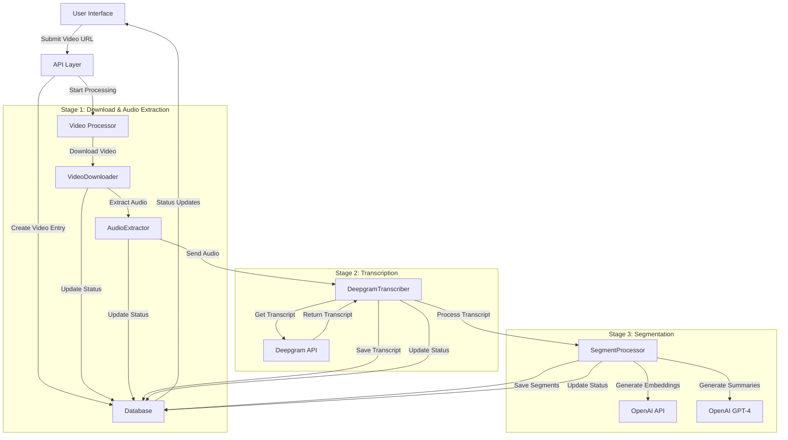

I'll explain the complete workflow of our video processing pipeline with a detailed diagram and explanation.



Let's break down each component and its role:

1. **Frontend (User Interface)**

- Located in: `src/web/src/components/VideoInputForm.tsx`
- Purpose:
  - Accepts video URL from user
  - Shows processing progress
  - Displays status updates
- Key Components:
  - React form with URL validation
  - Progress bar
  - Status messages
- API Calls:
  - POST `/api/videos/process`
  - GET `/api/videos/{id}` for status updates

2. **API Layer**

- Located in: `src/api/routers/`
- Purpose:
  - Handles HTTP requests
  - Validates input
  - Coordinates with services
- Key Endpoints:
  - `/videos/process`: Start video processing
  - `/videos/{id}`: Get video status
  - `/segments`: Get processed segments

3. **Database Layer**

- Located in: `src/db/models/`
- Tables:
  - `videos`: Stores video metadata and status
  - `transcriptions`: Stores Deepgram transcripts
  - `segments`: Stores processed segments with embeddings
- Uses:
  - PostgreSQL with pgvector for embeddings
  - Supabase for easy access

4. **Stage 1: Video Download & Audio Extraction**

- Components:
  ```
  src/pipeline/stages/stage1_download/
  ├── downloader.py
  └── audio_extractor.py
  ```
- VideoDownloader:
  - Supports YouTube and Loom videos
  - Uses yt-dlp for YouTube
  - Uses custom HTTP client for Loom
  - Updates progress and metadata
- AudioExtractor:
  - Uses FFmpeg
  - Converts to WAV format
  - Ensures proper audio settings (mono, 16kHz)

5. **Stage 2: Transcription**

- Located in: `src/pipeline/stages/stage2_transcription/`
- Components:
  - DeepgramTranscriber class
  - Deepgram API integration
- Process:
  1. Validates audio format
  2. Sends to Deepgram API
  3. Processes response
  4. Stores transcript
- Features:
  - Retry mechanism
  - Error handling
  - Progress tracking

6. **Stage 3: Segmentation**

- Located in: `src/pipeline/stages/stage3_segmentation/`
- Components:
  - SegmentProcessor class
  - OpenAI API integration
- Process:
  1. Text-based segmentation:
     - Splits transcript into sentences
     - Groups into segments (500 chars)
  2. Word-level segmentation (if available):
     - Uses word timing data
     - Groups into segments (50 words)
  3. For each segment:
     - Generate embeddings (OpenAI)
     - Generate summaries (GPT-4)
     - Save to database

7. **Services Integration**

```python
External Services:
- Deepgram: Speech-to-text API
  - Model: nova-2
  - Features: diarization, punctuation

- OpenAI: AI services
  - Embeddings: text-embedding-3-small
  - Summaries: GPT-4
```

8. **Data Flow**

```
Video URL → Download → Audio → Transcript → Segments → Embeddings/Summaries → Database
```

9. **Status Updates**

```python
Status Flow:
PENDING → DOWNLOADING → DOWNLOADED →
EXTRACTING_AUDIO → AUDIO_EXTRACTED →
TRANSCRIBING → TRANSCRIBED →
SEGMENTING → COMPLETED
```

10. **Error Handling**

- Each stage has:
  - Input validation
  - Error logging
  - Retry mechanisms
  - Status updates
  - Cleanup procedures

11. **Progress Tracking**

```python
Progress Calculation:
- Download: 0-20%
- Audio Extraction: 20-40%
- Transcription: 40-60%
- Segmentation: 60-80%
- Processing: 80-100%
```

12. **Configuration**

- Located in: `src/config/settings.py`
- Manages:
  - API keys
  - Service settings
  - Path configurations
  - Processing parameters

This pipeline is designed to be:

- Modular: Each stage is independent
- Robust: Includes error handling and retries
- Scalable: Can handle various video sources
- Maintainable: Well-documented and structured
- Observable: Comprehensive logging and progress tracking

The system follows these principles:

1. Fail fast and provide clear errors
2. Keep state in the database
3. Use async/await for better performance
4. Implement proper cleanup
5. Track progress and status
6. Handle retries and edge cases
7. Provide detailed logging

Would you like me to elaborate on any specific part of the system?
