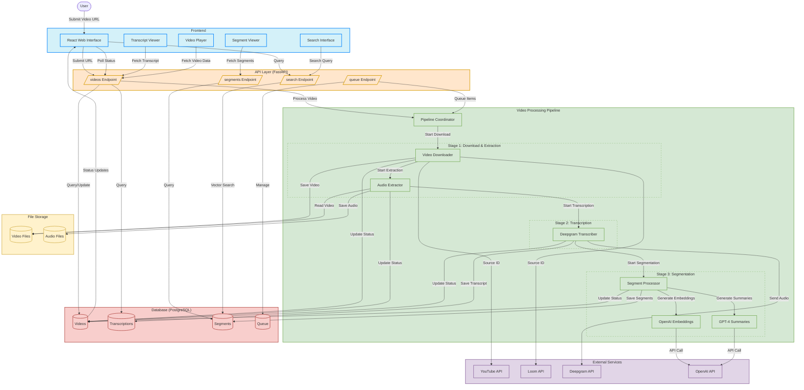

# Video Analytics System: Architecture & Flow

## System Overview

The video analytics system is designed to process video content through a modular pipeline, extracting audio, generating transcripts, segmenting content, and providing AI-powered insights. The system enables users to search, analyze, and interact with video content in powerful ways.

## Architecture Overview

The system follows a modular, pipeline-based architecture that processes videos through several sequential stages, from URL submission to searchable, segmented content with AI-generated insights.

### Core Components

1. **Frontend (React)**
   - User interface for submitting video URLs (YouTube, Loom)
   - Video playback and navigation
   - Transcript and segment exploration
   - Search functionality
   - Progress tracking and status monitoring

2. **API Layer (FastAPI)**
   - RESTful endpoints for video processing, retrieval and search
   - Background task management
   - Error handling and validation

3. **Database (PostgreSQL)**
   - Stores video metadata, transcripts, segments, and embeddings
   - Uses pgvector for vector similarity search
   - Managed through SQLAlchemy ORM

4. **Pipeline System**
   - Multi-stage processing with status tracking
   - Error handling and retries
   - Progress reporting

## Data Flow

1. **Video Submission**
   - User submits YouTube/Loom URL through frontend
   - API validates URL and creates a database entry
   - Background task initiates processing

2. **Processing Pipeline**
   - **Stage 1: Download & Audio Extraction**
     - VideoDownloader pulls video from source
     - AudioExtractor extracts WAV audio (mono, 16kHz)
     - Status updates sent to database
   
   - **Stage 2: Transcription**
     - DeepgramTranscriber sends audio to Deepgram API
     - Processes response with word timing and speaker data
     - Saves transcript to database
   
   - **Stage 3: Segmentation**
     - SegmentProcessor divides transcript into logical segments
     - Generates embeddings for each segment using OpenAI API
     - Creates segment summaries using GPT-4
     - Saves segments to database with vector embeddings

3. **User Interaction**
   - Frontend polls for status updates
   - Once complete, user can browse video, transcript, and segments
   - Search functionality using vector similarity

## System Flow Diagram



## Key Data Models

1. **Video**
   - Stores metadata (title, description, duration)
   - Tracks processing status and progress
   - References transcripts and segments

2. **Transcription**
   - Stores raw Deepgram response
   - Includes word-level timing and speaker data

3. **Segment**
   - Contains text content with start/end times
   - Stores vector embeddings (1536 dimensions)
   - Has additional metadata like speaker ID and titles

4. **Queue**
   - Manages video processing queue
   - Handles priorities and bulk uploads

## Technical Components

1. **External Services**
   - **Deepgram**: Speech-to-text API (nova-2 model)
   - **OpenAI**: Embeddings (text-embedding-3-small) and summaries (GPT-4)
   - **YouTube/Loom**: Video sources

2. **Key Libraries**
   - yt-dlp for YouTube downloads
   - FFmpeg for audio extraction
   - pgvector for vector search
   - SQLAlchemy for database ORM
   - FastAPI for backend API
   - React for frontend

3. **Error Handling**
   - Exponential backoff for retries
   - Detailed error logging
   - Status updates to database

4. **Progress Tracking**
   - Fine-grained progress per stage (0-100%)
   - Status enums (PENDING → DOWNLOADING → ... → COMPLETED)
   - Step completion tracking

## System Design Principles

1. **Modularity**
   - Each pipeline stage is independent
   - Separation of concerns between components

2. **Scalability**
   - Background processing of videos
   - Queue system for handling multiple videos
   - Processing status tracking

3. **Robustness**
   - Error handling at each stage
   - Retries with exponential backoff
   - Detailed error logging

4. **User Experience**
   - Real-time progress updates
   - Interactive segment navigation
   - Rich search capabilities
   - Minimal UI with loading states

## Processing Status Flow

```
PENDING → DOWNLOADING → DOWNLOADED →
EXTRACTING_AUDIO → AUDIO_EXTRACTED →
TRANSCRIBING → TRANSCRIBED →
SEGMENTING → COMPLETED
```

## Progress Calculation

```
Download: 0-20%
Audio Extraction: 20-40%
Transcription: 40-60%
Segmentation: 60-80%
Processing: 80-100%
```
